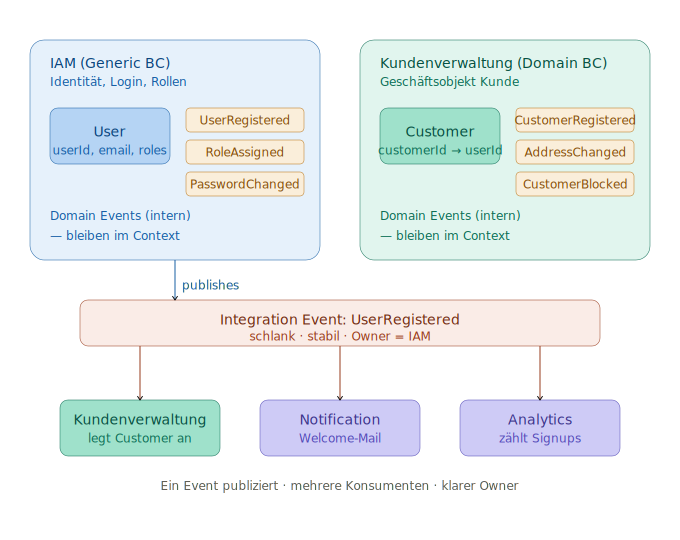

# IAM als Bounded Context — fachlich oder technisch?

## Die kritische Frage

Ein Bounded Context ist per DDD-Definition eine **sprachliche/fachliche Grenze** (Ubiquitous Language), keine technische.
Wenn IAM nur deshalb abgetrennt wird, weil "Authentifizierung ist halt Technik", ist das kein Bounded Context —
sondern eine technische Schicht (Shared Kernel, Infrastructure, Library).

## Wann IAM ein echter fachlicher BC ist

  * Es gibt eine eigene Fachlichkeit mit eigener Sprache: Rollen, Berechtigungen, Mandanten, Einladungs-Workflows, Access Reviews, Approval-Prozesse
  * Jemand im Business kümmert sich tatsächlich darum ("wer darf was") als eigene Domäne
  * Beispiel: SaaS mit komplexem Org-/Team-/Permission-Modell → ja, eigener BC

## Wann es kein eigener BC ist (häufiger als gedacht)

  * Du nutzt Keycloak / Auth0 / Entra ID → Authentifizierung ist ein **gekauftes Generic Subdomain**, eine externe Capability. Du integrierst dagegen über einen ACL, modellierst es aber nicht als eigenen BC.
  * "User registrieren" hat keine eigene Geschäftslogik außer "Datensatz anlegen" → das ist CRUD, kein BC.

## DDD-Einordnung

| Begriff | Bedeutung für IAM |
|---|---|
| Core Domain | fast nie — IAM ist selten dein Wettbewerbsvorteil |
| Generic Subdomain | meistens — "gelöstes Problem", kauf es ein |
| Supporting Subdomain | wenn du leichte eigene Logik brauchst |

## Bounded Context: Kundenverwaltung vs. IAM

Das Schaubild zeigt den sauberen Schnitt und das Owner-Konsumenten-Muster:



### IAM (Generic BC)

  * **User** als Login-Subjekt: Credentials, Rollen, Permissions, Tokens, MFA
  * Events: `UserCreated`, `PasswordChanged`, `RoleAssigned`, `LoggedIn`
  * Sprache: Security/Technik

### Kundenverwaltung (Domain-BC)

  * **Kunde** als Geschäftsobjekt: Stammdaten, Adressen, Präferenzen, Segment, Bonität, Vertragshistorie
  * Events: `CustomerRegistered`, `AddressChanged`, `CustomerBlocked`
  * Sprache: Marketing/Vertrieb

### Verbindung

Der Customer referenziert eine `userId` aus IAM (oder umgekehrt).
Beide sind getrennte Aggregate mit eigener ID — nicht dasselbe Objekt.

## Warum die Trennung wichtig ist

  * Nicht jeder User ist ein Kunde (Mitarbeiter, Admins, Service-Accounts)
  * Nicht jeder Kunde hat einen Login (B2B-Firmenkunde mit mehreren Usern; Laufkundschaft ohne Account)
  * Lifecycle ist unterschiedlich: User kann gesperrt werden, Kunde bleibt bestehen — und umgekehrt

**Häufige Falle:** "Kunde" und "User" in eine Tabelle/ein Aggregat packen.
Funktioniert am Anfang, rächt sich spätestens wenn ein Kunde mehrere Logins braucht oder ein Mitarbeiter auch Kunde wird.

## Authorization: fachlich vs. technisch

Autorisierung hat drei Ebenen mit unterschiedlicher Zuständigkeit:

| Ebene | Frage | Wo modellieren |
|---|---|---|
| Authentication | Wer bist du? | IAM (immer) |
| Coarse-grained Authorization | Rollen, Gruppen | IAM (eigener BC) |
| Fine-grained Authorization | "Nur der Auftragsersteller darf stornieren" | Domain-BC (domänenspezifische Regel) |

**Der typische Fehler:** Berechtigungslogik über alle Contexts verschmieren.
Sauberer ist: IAM stellt Identität + Rollen bereit, jeder Domain-Context entscheidet selbst, was diese Rollen in seinem Kontext dürfen.

## Im Event Storming: Authorization als Policy

Im Event Storming taucht Authorization an zwei Stellen auf:

  1. **Als Policy vor Commands** — die Frage "Darf dieser Actor dieses Command auslösen?" wird als gelbe Policy/Regel zwischen Actor und Command modelliert.
     Beispiel: `OrderPlaced` → Policy "nur Customer mit verifiziertem Account" → `ShipOrder`

  2. **Als eigener Kontext mit eigenen Events** — `UserRegistered`, `RoleAssigned`, `PermissionGranted`, `TokenIssued`.
     Diese laufen in einer eigenen Swimlane.

## Ein Event, mehrere Konsumenten

Ein Event "gehört" immer genau einem Bounded Context (dem, der es publiziert) — aber mehrere Contexts können es konsumieren:

```
IAM publiziert: UserRegistered
   |
   +-> Kundenverwaltung  (legt Customer an)
   +-> Notification       (schickt Welcome-Mail)
   +-> Analytics          (zählt Signups)
```

**Wichtige Unterscheidung:**

| Typ | Beschreibung |
|---|---|
| Domain Event (intern) | reichhaltig, contextspezifische Sprache, bleibt im Context |
| Integration Event (extern) | schlank, stabil, für andere Contexts gedacht |

**Anti-Pattern:** Geteiltes Event-Schema, das beide Contexts gemeinsam ändern müssen → erzeugt versteckte Kopplung.
Besser: Owner definiert das Schema, Konsumenten passen sich an (oder nutzen einen ACL).

## Typische Registrierungs-Szenarien

### 1. Self-Service Signup (B2C)

```
User klickt "Registrieren"
   |
IAM:    UserRegistered          <- Identität entsteht hier
   | (Integration Event)
Kunde:  CustomerRegistered      <- Kunde reagiert, legt Profil an
```

IAM ist der Auslöser. Kunde folgt.

### 2. Kunde wird vom Vertrieb angelegt (B2B)

```
Vertrieb legt Firmenkunde an
   |
Kunde:  CustomerRegistered      <- Kunde existiert zuerst (ohne Login!)
   | später, wenn jemand Zugang braucht
IAM:    UserRegistered          <- Login wird nachträglich erzeugt
   |
Kunde:  UserLinkedToCustomer
```

Kunde ist der Auslöser. IAM folgt — oder kommt gar nicht (Laufkundschaft).

### 3. Mitarbeiter-Onboarding

```
HR legt Mitarbeiter an
   |
IAM:    UserRegistered          <- nur User, kein Kunde
```

Nur IAM. Kein Customer-BC involviert.

## Faustregel

Frag im Event Storming nicht "ist das technisch oder fachlich?", sondern:

> **Spricht hier jemand eine andere Fachsprache, und ändert sich das Modell aus anderen Gründen?**

Wenn ja → Bounded Context. Wenn die einzige Antwort "das macht das Framework" ist → kein BC, sondern Infrastruktur.

Integration: Andere Contexts konsumieren IAM meist über ein Token (JWT mit Claims) oder einen ACL — kein direkter DB-Zugriff.
Im Event Storming zeichnet man das als Context Map mit Customer/Supplier-Beziehung (IAM = Upstream).
